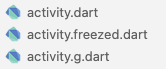
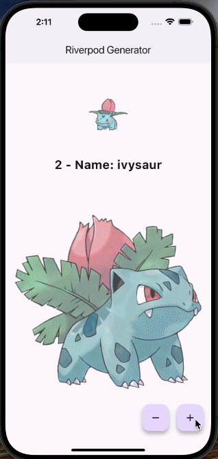

# Riverpod: code generation, `freezed` y `json_serializable` 
This repository demonstrates how to integrate and use Riverpod with code generation, `Freezed`, and `json_serializable` in a Flutter project. These tools facilitate state management, the generation of immutable classes, and JSON serialization/deserialization, respectively.

#### Advantages of Using `freezed` and `json_serializable`
1. Immutability and Safety: `freezed` facilitates the creation of immutable classes with optional, required, and safely copyable properties. This helps prevent errors and makes state management easier.

2. Equality and Comparison: `freezed` automatically generates `==` and `hashCode` methods, making object comparison straightforward.

3. Serialization: `json_serializable` simplifies the conversion between JSON and Dart objects. This is especially useful for applications that interact with RESTful APIs or store data locally.

4. Efficiency: Code generation saves time and reduces errors, ensuring that data models are consistent and easy to maintain.

5. Compatibility with Riverpod: Models generated with `freezed` integrate well with Riverpod state providers, allowing for more robust and predictable state management.

## Step 1: run build_runner
run on project path to generate code
```bash
dart run build_runner watch
```

## Step 2: main configuration
```dart
import 'package:flutter_riverpod/flutter_riverpod.dart';

void main() {
  runApp(
    const ProviderScope( //wraps to main widget
      child: MyApp(),
    ),
  );
}
```
## Step 3: add model
This setup provides a robust, type-safe way to handle data models, especially when dealing with APIs and complex state management scenarios.

```dart
import 'package:freezed_annotation/freezed_annotation.dart';

part 'activity.freezed.dart';
part 'activity.g.dart';
```
1.  Imports:
    -   freezed_annotation/freezed_annotation.dart is imported to use the @freezed annotation and other related utilities.
2.  Part Directives:
    -   part 'activity.freezed.dart'; and part 'activity.g.dart'; tell the Dart compiler that the generated code for the Activity class will be located in these files. These files are auto-generated by the `freezed` and `json_serializable` packages.

#### `Freezed` Class Definition
```dart
@freezed
class Activity with _$Activity {
  factory Activity({
    int? id,
    String? key,
    String? activity,
    String? type,
    required String name,
    int? participants,
    double? price,
    Map? sprites,
  }) = _Activity;

  factory Activity.fromJson(Map<String, dynamic> json) =>
      _$ActivityFromJson(json);
}
```
1.	Annotation:
	@freezed: This annotation indicates that the Activity class will use `freezed` for generating immutable classes,      equality, copy methods, etc.
2.	Class Definition:
    class Activity with _$Activity {}: The Activity class uses a mixin _$Activity, which is part of the generated code that includes utility methods and properties.
3.	Factory Constructor:
    factory Activity({ ... }) = _Activity;: This defines a factory constructor for the Activity class. The constructor accepts various fields (e.g., id, key, activity, type, name, participants, price, sprites). The = _Activity part tells `freezed` to generate a private implementation class _Activity.
4.	fromJson Factory:
    factory Activity.fromJson(Map<String, dynamic> json) => _$ActivityFromJson(json);: This factory constructor allows for the creation of an Activity instance from a JSON object. The function _$ActivityFromJson(json) is generated by `json_serializable` and provides a type-safe way to deserialize JSON into an Activity object.

#### Generated Archives


-   activity.freezed.dart: Contains the generated implementation of the Activity class, including equality, copyWith, and other utility methods.
-   activity.g.dart: Contains the generated fromJson and toJson methods, facilitating the conversion between JSON and the Activity class.

#### How It All Works Together
1.	Defining the Model: Using @freezed, you define an immutable data model with various fields and a constructor.
2.	Generating Code: The build_runner tool generates the necessary code for immutability, serialization, and other utilities in the specified part files.
3.	Serialization: `json_serializable` generates fromJson and toJson methods, making it easy to convert JSON data to Dart objects and vice versa.
4.	Immutability and Safety: The generated _Activity class ensures that the model is immutable, and `freezed` provides methods for safely copying and modifying instances.

This setup provides a robust, type-safe way to handle data models, especially when dealing with APIs and complex state management scenarios.
## Step 4: creating a supplier
We will add a provider that obtains information from an API and transforms it into an object.
```dart
import 'package:http/http.dart' as http;
import 'package:riverpod_annotation/riverpod_annotation.dart';

part 'pokemon_provider.g.dart';

@Riverpod(keepAlive: true)
Future<Activity> activity(ActivityRef ref, {int idPokemon = 1}) async {
  final response =
      await http.get(Uri.https('pokeapi.co', '/api/v2/pokemon/$idPokemon'));
  final json = jsonDecode(response.body) as Map<String, dynamic>;
  return Activity.fromJson(json);
}
```
1.	@Riverpod(keepAlive: true):
	-	Esta anotación indica que estás creando un provider usando Riverpod.
	-	El parámetro keepAlive: true significa que el provider mantendrá su estado en memoria incluso si no está siendo utilizado activamente. Esto es útil si quieres conservar la información entre reconstrucciones de widgets o cambios en la UI.
2.	Future activity(ActivityRef ref, {int idPokemon = 1}) async:
	-	Este es un provider asincrónico que devuelve un Future<Activity>. El provider usa la referencia ActivityRef para acceder a otros providers si es necesario.
	-	idPokemon es un parámetro opcional que tiene un valor predeterminado de 1. Esto permite obtener la información de un Pokémon específico (por defecto, el Pokémon con ID 1).
3.	await http.get(Uri.https(‘pokeapi.co’, ‘/api/v2/pokemon/$idPokemon’)):
	-	Realiza una solicitud HTTP GET a la API de Pokémon para obtener datos sobre un Pokémon específico utilizando su ID.
4.	final json = jsonDecode(response.body) as Map<String, dynamic>:
	-	Decodifica la respuesta JSON del servidor en un mapa de claves y valores (Map<String, dynamic>).
5.	return Activity.fromJson(json):
	-	Convierte el mapa JSON en una instancia de Activity usando un método fromJson definido en la clase Activity.

```dart
@Riverpod(keepAlive: true)
class Counter extends _$Counter {
  @override
  int build() => 1; // init state

  int increment() {
    state++;
    ref.invalidate(activityProvider);
    return state;
  }

  int decrement() {
    state--;
    if (state == 0) {
      state = 1;
      Fluttertoast.showToast(
        msg: 'No hay pokemones.',
        backgroundColor: Colors.red,
        toastLength: Toast.LENGTH_SHORT,
      );
    }

    ref.invalidate(activityProvider);
    return state;
  }
}
```

#### Code Analysis
Code Analysis

1.	@Riverpod(keepAlive: true)
	-	This annotation indicates that you are defining a provider using Riverpod.
	-	keepAlive: true means that the provider should stay in memory even if it is not actively used. This ensures that the state is not lost between widget rebuilds.
2.	class Counter extends _$Counter
	-	Here you define a Counter class that extends _Counter, a class automatically generated by Riverpod when you use @Riverpod. This extension allows you to work with state management in a more structured way.
3.	@override int build() => 1;
	-	The build method is used to initialize the provider’s state. In this case, the initial state of Counter is 1.
4.	int increment()
	-	Method that increments the state value.
	-	After incrementing the state, it invalidates the activityProvider (causing it to be re-fetched the next time it is used).
	-	Returns the new state value.
5.	int decrement()
	-	Method that decrements the state value.
	-	If the state reaches 0, it is reset to 1 and a toast message is shown indicating that there are no more pokemons.
	-	After decrementing the state (or resetting it), it invalidates the activityProvider.
	-	Returns the new state value.

## Step 5: manage and access status
The `activity` variable is used to manage and access the state of asynchronous data.

```dart
final AsyncValue<Activity> activity = ref.watch(activityProvider(idPokemon: count));
```

#### Use the `activity.when`
The `activity.when` method is used to handle different states of an AsyncValue in Riverpod. It provides a way to specify what should be displayed or how the application should react depending on whether the asynchronous data is still loading, has been successfully retrieved, or encountered an error.

```dart
activity.when( 
    data: (data) {
        //return widget
        },
    error: (error, stackTrace){
        //return widget
        },
    loading: () => const CircularProgressIndicator(),
)
```

#### Breakdown of the when Method
1. **data**:
   - **Purpose**: This callback is called when the `AsyncValue` contains the successfully fetched data.
   - **Parameter**: It receives the data (an `Activity` object in this case) as an argument.
   - **Usage**: You can use this to build widgets that display the data to the user, such as showing the activity name.

2. **loading**:
   - **Purpose**: This callback is called while the asynchronous operation is still in progress.
   - **Parameter**: It does not receive any arguments.
   - **Usage**: You can use this to show a loading indicator or some placeholder content to inform the user that data is being fetched.

3. **error**:
   - **Purpose**: This callback is called if there is an error during the asynchronous operation.
   - **Parameters**: It receives the error and optionally a stack trace.
   - **Usage**: You can use this to display an error message or handle the error gracefully.

#### Use the `ref.read`
`ref.read` is a method used to access the current state or value of a provider without subscribing to updates.

```dart
    ref.read(counterProvider.notifier).decrement()
```

In Riverpod, the `.notifier` property is used to access the state notifier instance associated with a provider. This is particularly useful when you are working with StateNotifierProvider or ChangeNotifierProvider and need to interact directly with the state management logic of these providers.

## Documentation
riverpod official page [here](https://riverpod.dev/es/docs/concepts/about_code_generation)

# DEMO

The video shows how an API is consumed, at the beginning of the query a loading appears, then when you query again it no longer appears thanks to the `@Riverpod(keepAlive: true)` that saves it in memory even if it is not actively used:

